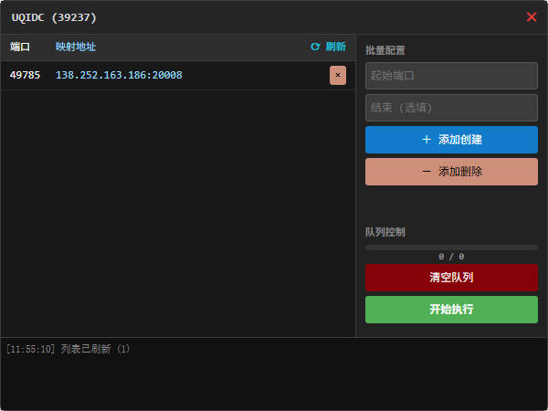

# UQIDC NAT Manager

一个更好用、更可靠的 UQIDC NAT 管理面板。  
  
创建这个项目的原因是因为 UQIDC 自带的 NAT 面板过于难用，因此对照 API 接口实现了一个更顺手的管理面板。

## 功能概览

- 可视化面板：批量创建/删除端口映射
- 队列执行：支持开始、暂停、清空、失败重试
- 进度与日志：进度条、实时日志、失败列表
- 限流保护：内置限流器，避免请求过快
- 右下角版本号展示

## 使用方式（浏览器控制台加载）

1. 打开 UQIDC 的 NAT 管理页面（URL 里需要包含 `?id=xxx`）。
2. 按 `F12` 打开控制台。
3. 粘贴并回车执行下面的脚本加载面板：

```js
(() => {
  const url = "https://cdn.jsdelivr.net/gh/LandmineHQ/uqidc-nat-manager/main.js";
  const script = document.createElement("script");
  script.src = url;
  script.type = "text/javascript";
  script.async = true;
  script.onerror = () => { console.error("加载脚本失败:", url); };
  document.head.appendChild(script);
})();
```

## 注意事项

- 仅在 [🔗 UQIDC 客户面板](https://www.uqidc.com/clientarea) 页面使用，并确保 URL 带有 `id` 参数。
- 首次打开面板会自动尝试刷新列表。
